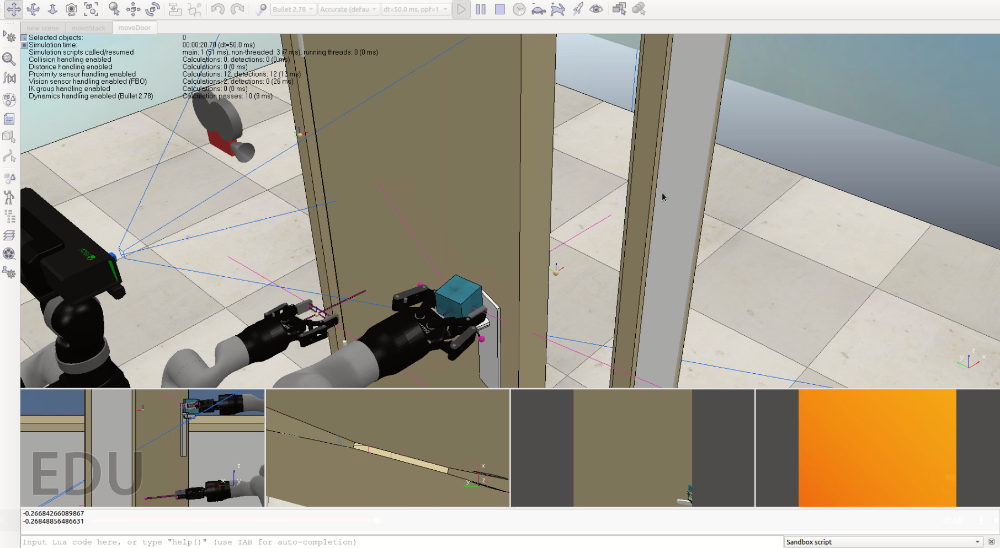
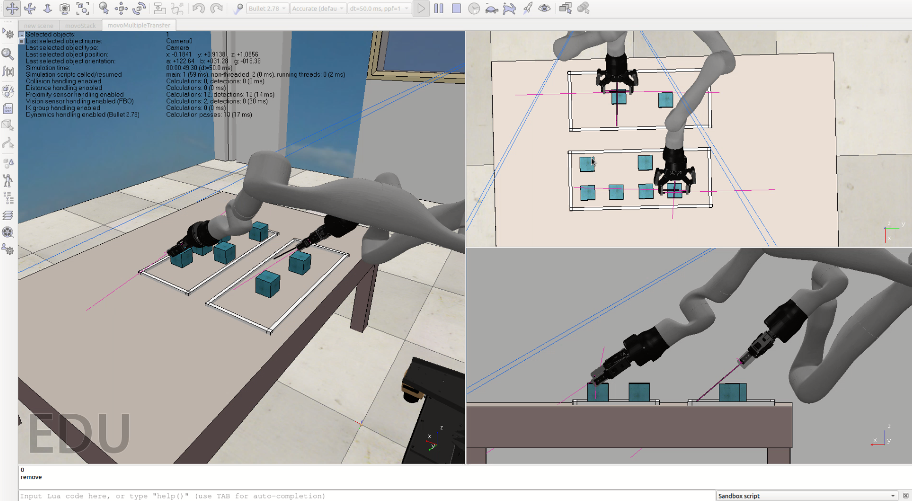
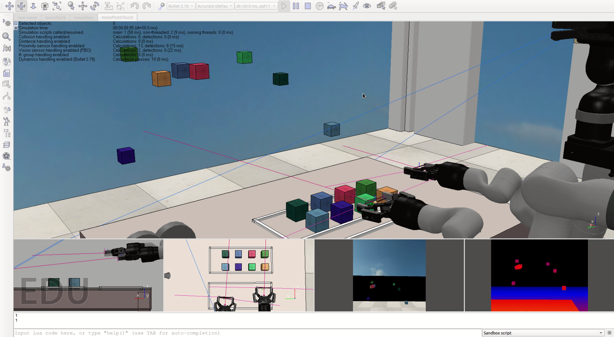
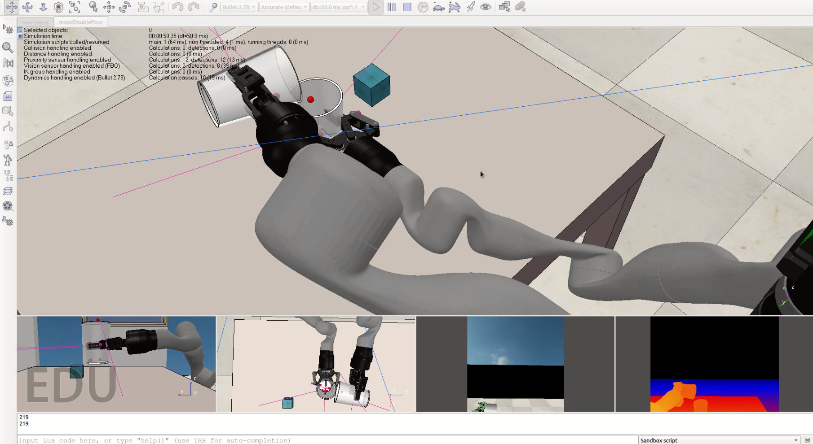
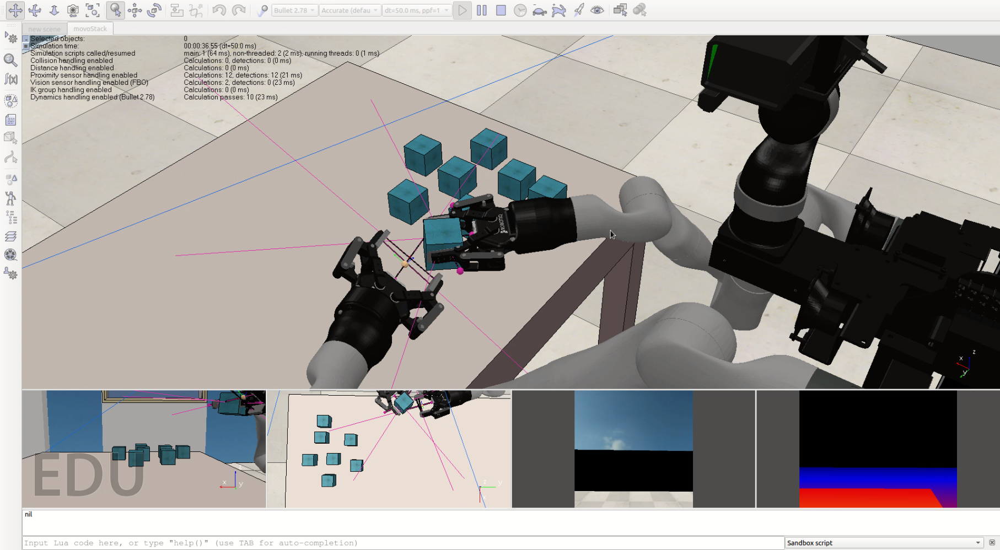

# Summer 2020 Report

Final report for work done over the summer under Prof. Michael Gleicher.
Worked on creating various tasks in CoppeliaSim using the Movo robot. Also worked on various Xbox control schemes for the Movo.

## 1. Files
1. [Movo control ROS package (ver 3)](https://github.com/joshuawisc/movo-control-3)
2. [Movo simulated tasks]()
3. [CoppeliaSim object models]()

## [2. Report](Report.md)

## 3. Results

#### Movo simulation:

##### movoDoor

##### movoMultipleTransfer

##### movoPointTouch

##### movoPour

##### movoStack

